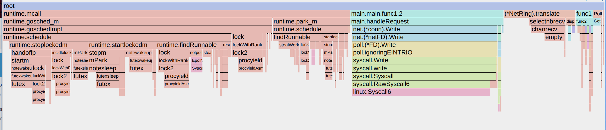
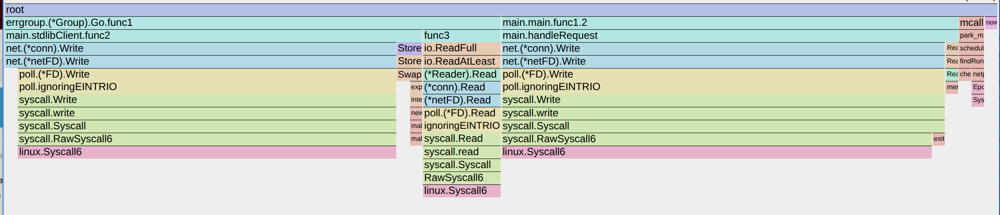

# netring
Go-frendly envelope for io_uring and network operations.

## Status

Failed. Because M:N model is absolutely incompatible with SQ/CQ async. The cost of making synchronous API
is just way too high. Thread safe access to SQ alone is too expensive. And the way back to task issuer
takes even more.

If it were be possible to pin a goroutine to an OS thread and then the switch became a lot cheaper and
a dedicated ring per thread would make them 100% lockless. Then it would work.

## Netring client and stdlib server profile.

## Stdlib client and server profile.
